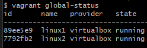

# vagrant_alpine_docker_simpleLogic

## 1. vagrant download
  

## 2. Vagrantfile 있는 폴더에서 git bash 열기
## 3. vagrant global-status로 전역상태 확인
  

## 4. vagrant up

## 5. virtual box에서 alpine linux 실행 확인
  

## 6. vagrant global-status
## 7. vagrant halt(stop)

## 8. vagrant detroy
  

